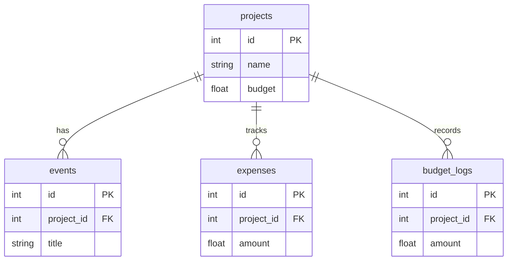

# CyberX Planning & Management System

A centralized project and activity management platform designed for the **CyberX** college cybersecurity club. This platform helps club leads and members organize long-running projects, track complex finances, and manage tasks efficiently.

## 🚀 Key Features

### 📂 Project & Task Management
- **Hierarchical Structure**: Organize work into high-level Projects with nested individual Tasks.
- **Jira-Style Kanban**: Interactive board with horizontal **Swimlanes** grouped by project.
- **Drag-and-Drop**: Seamlessly move tasks between stages (Ideation, To-Do, In Progress, Done).
- **Project Timelines**: Set clear Start and End dates for club initiatives.

### 💰 Finance & Budgeting
- **Project Ledgers**: Dedicated financial tracking for every project.
- **Expense Logging**: Record every purchase with name, amount, and date.
- **Proof of Purchase**: Upload and store bill/receipt images directly on the platform.
- **Budget History**: Automatically logs every budget adjustment for full financial transparency.
- **Real-time Tracking**: Visual budget meters showing percentage of funds spent.

### 📊 Professional Reporting
- **PDF Audit Reports**: Generate detailed project reports including:
    - Financial summaries and budget revision history.
    - Itemized expense tables.
    - **Appendix of Proofs**: Automatic embedding of all uploaded receipt images.

### 🎨 Custom Branding
- Fully themed with CyberX club colors (#1c5070, #ae0001, #44a6cc).
- Professional dark-themed UI with glass-morphism effects.

## 🛠️ Tech Stack
- **Backend:** FastAPI (Python)
- **Database:** SQLite with SQLAlchemy (WAL mode enabled for high concurrency)
- **Reporting:** fpdf2
- **Frontend:** Vanilla JS, Tailwind CSS, Lucide Icons

## 🗄️ Database Schema

The system uses a relational SQLite database. Below are the table definitions:

### 1. `projects`
Stores high-level club initiatives and their primary budgets.

| Column | Type | Description |
| :--- | :--- | :--- |
| `id` | Integer | Primary Key (Auto-increment) |
| `name` | String | Project name (Indexed) |
| `description` | Text | Detailed project overview |
| `start_date` | Date | Projected start date (Nullable) |
| `end_date` | Date | Projected deadline (Nullable) |
| `budget` | Float | Total allocated funds (Default: 0.0) |

### 2. `events` (Tasks)
Individual tasks or events linked to projects.

| Column | Type | Description |
| :--- | :--- | :--- |
| `id` | Integer | Primary Key (Auto-increment) |
| `title` | String | Task title (Indexed) |
| `description` | Text | Task details |
| `date` | Date | Scheduled date |
| `budget` | Float | Specific budget allocation (Default: 0.0) |
| `status` | String | Current stage (e.g., To-Do, In Progress, Done) |
| `completed` | Boolean | Completion flag (Default: False) |
| `project_id` | Integer | Foreign Key -> `projects.id` |

### 3. `expenses`
Financial expenditures recorded against projects.

| Column | Type | Description |
| :--- | :--- | :--- |
| `id` | Integer | Primary Key (Auto-increment) |
| `name` | String | Expense name/description (Indexed) |
| `amount` | Float | Cost of the expense |
| `date` | Date | Date of expenditure |
| `receipt_path` | String | Local path to the uploaded receipt image |
| `project_id` | Integer | Foreign Key -> `projects.id` |

### 4. `budget_logs`
Automated audit trail for all budget adjustments.

| Column | Type | Description |
| :--- | :--- | :--- |
| `id` | Integer | Primary Key (Auto-increment) |
| `amount` | Float | The updated budget amount |
| `change_date` | DateTime | Timestamp of the modification (Auto-generated) |
| `project_id` | Integer | Foreign Key -> `projects.id` |

### Relationships & Mapping

The database follows a **One-to-Many (1:N)** relationship model centered around the `projects` table:

- **Projects ↔ Tasks (`events`)**: A single project can have multiple tasks. Linked via `events.project_id`.
- **Projects ↔ Expenses**: A single project tracks multiple expenses. Linked via `expenses.project_id`.
- **Projects ↔ Budget Logs**: A single project maintains a history of budget changes. Linked via `budget_logs.project_id`.



## 🏁 Getting Started

### Prerequisites
- Python 3.12+
- `python-multipart` (for receipt uploads)

### Installation
1. **Clone the repository:**
   ```bash
   git clone https://github.com/itsdavidmandal/cyberx-management-system.git
   cd cyberx-management-system
   ```

2. **Set up the virtual environment:**
   ```bash
   python3 -m venv venv
   source venv/bin/activate  # On Linux/macOS
   ```

3. **Install Dependencies:**
   ```bash
   pip install -r backend/requirements.txt
   ```

### Running the App
Use the provided run script:
```bash
./run.sh
```
Or manually:
```bash
python3 -m uvicorn backend.main:app --reload
```

Open: `http://127.0.0.1:8000`

## 📂 Project Structure
- `backend/`: API logic, SQLAlchemy models, and database management.
- `static/`: Frontend application and styling.
- `static/uploads/`: Secure storage for uploaded receipts (git-ignored).
- `planning.db`: SQLite database optimized with WAL mode.
